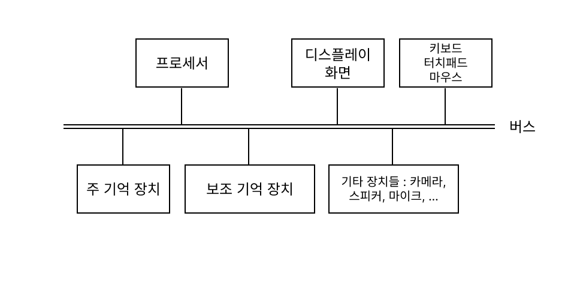

# 🖋 1일 1로그 100일 완성 IT 지식

### 1부 : 하드웨어
#### 001 컴퓨터의 논리와 구조

- 컴퓨터의 두 가지 측면 : 
  1. 논리적 구성(기능적 구성) : 컴퓨터는 어떤 부분들로 이루어져 있고 무슨 일을 하며 어떻게 연결되는가?
  2. 물리적 구조 : 각 부분이 어떻게 생겼고 어떻게 만들어지는가?
- 논리적인 측면에서 오늘 날의 컴퓨터는 1950년대의 컴퓨터와 크게 유사하지만 물리적인 차이는 매우 크다.
- 컴퓨터가 '*무엇을 하는지*'는 꽤나 안정적으로 유지되고 있음

#### 002 프로세서 속도와 심장 박동수

- 일반적인 컴퓨터의 논리적 / 기능적 아키텍처
    
    - 폰 노이만 아키텍처라고도 부름

- **프로세서** : 역사적으로 CPU라고 불림
    - 산술 연산 수행, 데이터를 여기저기로 옮기며, 다른 구성 요소의 작업을 제어

- **주 기억 장치** : 흔히 RAM이라고 부름
    - 프로세서가 현재 작업중인 데이터뿐만 아니라 프로세서가 그 데이터로 무엇을 해야 하는지 알려 주는 명령어도 저장함
        - 메모리에 다른 명령어를 로드(적재)하여 프로세서가 다른 계산을 수행하게 할 수 있음 (**프로그램 내장식**)
    - 주 기억 장치는 컴퓨터가 실행되는 동안 정보를 저장할 장소를 제공
    - 현재 활성화된 프로그램의 명령어 저장
    - 애플리케이션 여러 개를 동시에 실행할 수 있도록 배후에서 작동하는 운영체제의 명령어도 저장
    
    - 주 기억 장치를 RAM(임의 접근 메모리)라고 부르는 이유 :
        - 프로세서가 정보에 접근할 때 메모리에 저장된 위치와 무관하게 다른 속도로 접근할 수 있기 때문
        - 메모리의 어떤 위치에 무작위로 접근하더라도 접근 속도는 거의 비슷함
    
    - 휘발성 : 전원이 꺼지면 메모리의 내용은 사라지고 현재 활성화된 모든 정보가 없어짐
    - 동시에 여러 프로그램을 실행할 때 컴퓨터 속도를 올리고자 하면 RAM을 업그레이드해야 함

#### 003 HDD와 SSD의 차이

- **보조 기억 장치**
    - 주 기억 장치와 다르게 전원이 꺼져 있을 때도 정보 유지
    - 두 종류가 있음
        1. 하드 디스크(하드 드라이브)
        2. SSD
    - 요즘에는 디스크를 쓰지 않고 SSD 사용
        - SSD는 회전하는 기계 장치 대신 **플래시 메모리**가 들어있다.
            - 더 빠르고, 가볍고 안정적
    - 추상화 : 물리적인 구현의 세부사항을 숨김
        - 어떤 물리적 구조(수단)든 비슷한 계층 구조로 저장된 것처럼 보이게 만들 수 있음

#### 004 가로세로 1cm 프로세서 칩

- 컴퓨터의 전자 회로 : 몇 가지 기본 소자가 매우 많이 모여 만들어짐
    - 논리 게이트 : 
        - 한 개나 두 개의 입력 값을 바탕으로 단일 출력 값을 계산
        - 전압/전류 같은 입력 신호를 이용하여 전압/전류인 출력 신호 제어
        - 이런 게이트를 조합하면 어떤 종류의 계산도 수행 가능
        - 집적회로(=칩, 마이크로칩) 상에서 만들어짐

    - 트랜지스터 : 스위치의 역할
